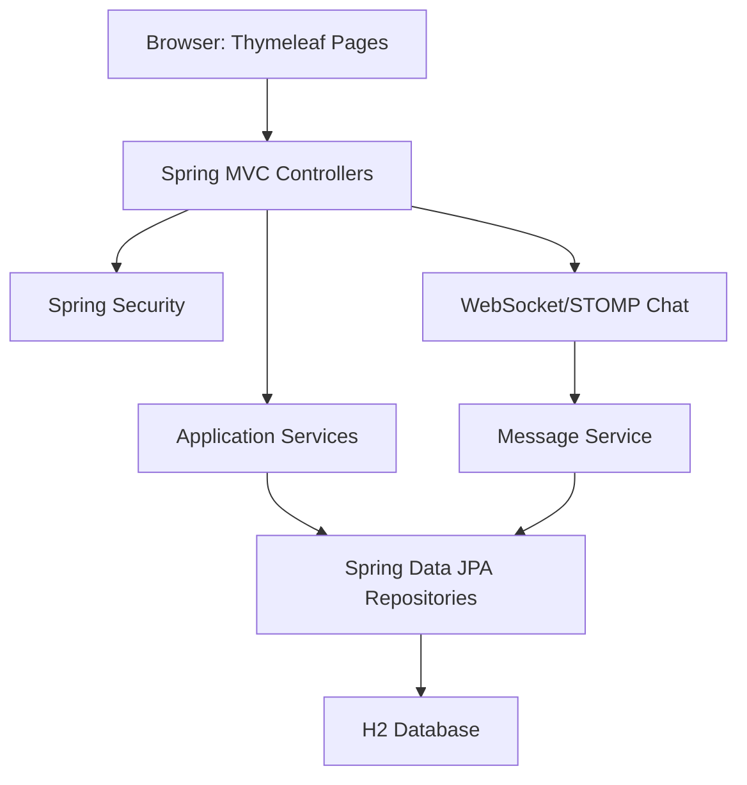
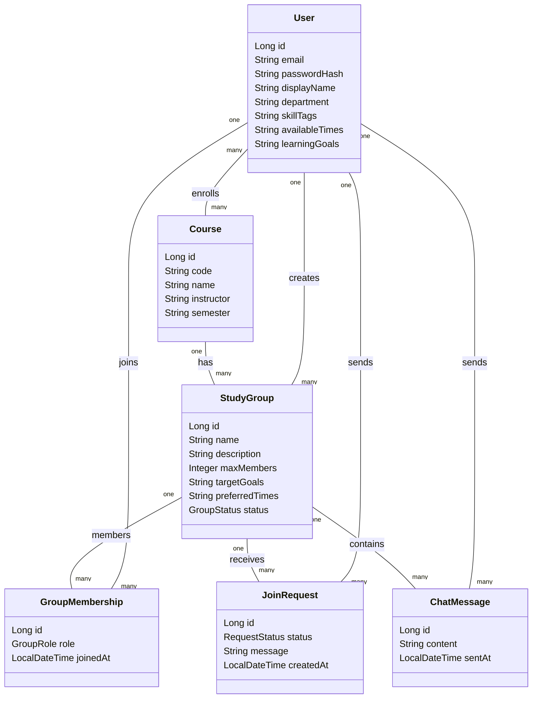

# StudyLink Agent 開發規劃

本文件用來引導後續 AI Agent 分階段完成期末 Java 專案 `StudyLink`。每一階段都應留下清楚的 Git commit、測試結果與 AI 協作紀錄，讓期末展示能呈現「Vibe Coding 如何參與 project planning、framework selection、technical decision、test design、debugging、refactoring、architecture design」。

## 1. 專案定位

### 1.1 專案名稱

`StudyLink`

### 1.2 核心概念

StudyLink 是一個校園讀書夥伴與讀書小組媒合系統。學生可以建立課程、尋找修同一門課的人、建立或加入讀書小組，並依照技能標籤、可讀書時間、學習目標進行媒合。系統提供簡化版即時聊天室，讓同組成員可以快速討論讀書安排。

### 1.3 目標使用者

- 想找同課同學一起準備考試、作業或專題的學生
- 想招募組員的讀書小組發起人
- 希望用時間、技能、學習目標快速找到適合夥伴的學生

### 1.4 MVP 範圍

必做功能：

- 使用者註冊、登入、登出
- 使用者個人資料：姓名、系級、技能標籤、可讀書時間、學習目標
- 課程建立與課程列表
- 加入課程、查看同課同學
- 建立讀書小組
- 讀書小組招募資訊與加入申請
- 依課程、技能、時間、學習目標進行簡化媒合
- 讀書小組聊天室
- 基本單元測試與整合測試

延伸功能：

- 小組申請審核流程
- 收藏課程或小組
- 通知中心
- 更完整的 WebSocket 即時聊天
- 簡易推薦分數視覺化

## 2. 技術選型

### 2.1 建議技術棧

- 語言：Java 21
- 後端框架：Spring Boot 3
- Web UI：Thymeleaf + Bootstrap 5
- 資料庫：H2 database for development/demo
- ORM：Spring Data JPA
- 驗證：Jakarta Bean Validation
- 安全：Spring Security
- 聊天：Spring WebSocket + STOMP，若時間不足可先用輪詢式 message board
- 測試：JUnit 5、Spring Boot Test、AssertJ、Mockito
- 建置工具：Maven
- 圖表：Mermaid 或 PlantUML

### 2.2 選型理由

- Spring Boot 適合 Java 課程專案，能快速建立 MVC、資料庫、安全驗證與測試。
- Thymeleaf 可減少前後端分離成本，讓三人團隊能把重點放在 Java 架構與功能完整度。
- H2 方便期末展示，不需要額外安裝資料庫。
- WebSocket 能展現多媒體系統與應用中的互動性；若時程緊，可降級為一般留言式聊天室。
- Maven、Spring Boot Test 與 GitHub Actions 容易保留可驗證的開發歷程。

## 3. 團隊分工建議

### 3.1 角色 A：後端與資料模型

- 建立 Spring Boot 專案結構
- 設計 entity、repository、service
- 實作課程、小組、媒合核心邏輯
- 撰寫 service unit tests

### 3.2 角色 B：使用者流程與安全

- 實作註冊、登入、登出
- 實作 profile 編輯
- 串接 Spring Security
- 撰寫 controller integration tests

### 3.3 角色 C：前端頁面與展示

- 設計 Thymeleaf templates
- 實作小組列表、課程頁、媒合結果頁、聊天室頁
- 整理 Mermaid/PlantUML 圖與 demo script
- 協助 UI polish 與使用者流程測試

## 4. 系統架構

### 4.1 分層架構



### 4.2 建議 package 結構

```text
src/main/java/com/example/studylink
  StudyLinkApplication.java
  config/
    SecurityConfig.java
    WebSocketConfig.java
  user/
    User.java
    UserRepository.java
    UserService.java
    UserController.java
    ProfileForm.java
  course/
    Course.java
    CourseRepository.java
    CourseService.java
    CourseController.java
    CourseForm.java
  group/
    StudyGroup.java
    GroupMembership.java
    JoinRequest.java
    StudyGroupRepository.java
    GroupMembershipRepository.java
    JoinRequestRepository.java
    StudyGroupService.java
    StudyGroupController.java
    StudyGroupForm.java
  matching/
    MatchCriteria.java
    MatchResult.java
    MatchingService.java
    MatchingController.java
  chat/
    ChatMessage.java
    ChatMessageRepository.java
    ChatService.java
    ChatController.java
  common/
    CurrentUser.java
    NotFoundException.java
    GlobalExceptionHandler.java
```

### 4.3 核心 Entity



## 5. 開發階段規劃

### Phase 0：專案啟動與需求定義

目標：

- 建立清楚的專案範圍、使用者故事、技術決策紀錄
- 初始化 Git repository 與基本 README

Agent 任務：

1. 建立 `README.md`，說明 StudyLink 的問題、目標使用者、MVP 功能、demo 流程。
2. 建立 `docs/decision-log.md`，記錄技術選型與取捨。
3. 建立 `docs/ai-collaboration-log.md`，紀錄每次 AI 協助內容。
4. 建立 `docs/diagrams/architecture.md`，放 Mermaid 架構圖。
5. 初始化 Git，建立第一次 commit。

驗收標準：

- `README.md` 能讓老師在 3 分鐘內理解專案。
- `decision-log.md` 至少包含 Spring Boot、Thymeleaf、H2、WebSocket 的選擇理由。
- Git 至少有 `chore: initialize project planning docs` commit。

建議 Agent prompt：

```text
請根據 Agents.md 的 Phase 0 建立 StudyLink 的 README、技術決策紀錄、AI 協作紀錄與架構圖文件。內容要適合期末專案展示，使用繁體中文，並保留後續可填寫的紀錄表格。
```

### Phase 1：建立 Spring Boot 骨架

目標：

- 建立可執行的 Java Web 專案
- 完成基本首頁與 health check

Agent 任務：

1. 使用 Spring Initializr 或 Maven 建立 Spring Boot 3 專案。
2. 加入 dependencies：Spring Web、Thymeleaf、Spring Data JPA、H2、Validation、Spring Security、WebSocket、Test。
3. 建立首頁 `/`。
4. 建立簡單 `/health` endpoint。
5. 設定 H2 console 僅供開發使用。
6. 建立 base layout template。

驗收標準：

- `mvn test` 通過。
- `mvn spring-boot:run` 後可開啟首頁。
- `/health` 回傳簡單狀態。
- Git commit：`chore: bootstrap Spring Boot project`。

建議 Agent prompt：

```text
請依照 Agents.md Phase 1 建立 StudyLink Spring Boot 專案骨架。請使用 Maven、Java 21、Spring Boot 3、Thymeleaf、H2、JPA、Validation、Security、WebSocket。完成後執行測試並回報結果。
```

### Phase 2：使用者註冊登入與 Profile

目標：

- 完成基本使用者帳號系統
- 讓使用者能填寫媒合需要的個人資料

Agent 任務：

1. 建立 `User` entity。
2. 建立 `UserRepository`、`UserService`。
3. 實作註冊、登入、登出。
4. 密碼必須用 `BCryptPasswordEncoder` hash。
5. 建立 profile 編輯頁：姓名、系級、技能標籤、可讀書時間、學習目標。
6. 加入表單驗證與錯誤訊息。
7. 加入測試：註冊成功、重複 email 失敗、密碼 hash、profile 更新。

驗收標準：

- 未登入使用者不能進入需要登入的頁面。
- 註冊後能登入並編輯 profile。
- 使用者密碼不可以明文存入資料庫。
- `mvn test` 通過。
- Git commit：`feat: add authentication and user profiles`。

建議 Agent prompt：

```text
請依照 Agents.md Phase 2 實作使用者註冊、登入、登出與 profile 編輯。請優先遵守 Spring Security 慣例，密碼使用 BCrypt，並補上 service/controller 測試。
```

### Phase 3：課程管理與同課同學

目標：

- 建立課程資料
- 讓學生加入課程並查看同課同學

Agent 任務：

1. 建立 `Course` entity 與使用者課程關聯。
2. 實作課程列表、建立課程、課程詳細頁。
3. 實作加入課程、退出課程。
4. 在課程詳細頁顯示同課同學與 profile 摘要。
5. 加入搜尋：課號、課名、教師。
6. 建立 seed data，方便展示。
7. 加入 service tests 與 controller tests。

驗收標準：

- 登入使用者可以建立並加入課程。
- 課程頁能看到同課同學。
- 搜尋功能可用。
- 重複加入同一課程不會產生重複資料。
- `mvn test` 通過。
- Git commit：`feat: add courses and classmate discovery`。

建議 Agent prompt：

```text
請依照 Agents.md Phase 3 實作課程管理與尋找同課同學功能。請注意使用者與課程的 many-to-many 關係、重複加入防呆、展示用 seed data 與測試。
```

### Phase 4：讀書小組與招募流程

目標：

- 使用者能在課程下建立讀書小組
- 其他使用者能申請加入

Agent 任務：

1. 建立 `StudyGroup`、`GroupMembership`、`JoinRequest` entity。
2. 實作小組列表、小組詳細頁、建立小組。
3. 建立者自動成為 owner。
4. 實作加入申請。
5. 實作 owner 審核申請：接受、拒絕。
6. 限制小組人數上限。
7. 加入小組狀態：open、full、closed。
8. 加入測試：建立小組、申請加入、接受申請、滿員限制、權限限制。

驗收標準：

- 課程詳細頁能看到該課程的小組。
- 使用者能申請加入非自己的小組。
- 只有 owner 可以審核申請。
- 小組滿員後不能再接受新成員。
- `mvn test` 通過。
- Git commit：`feat: add study groups and join requests`。

建議 Agent prompt：

```text
請依照 Agents.md Phase 4 實作讀書小組與招募流程。請特別注意 owner 權限、滿員限制、join request 狀態轉移，並為核心規則撰寫測試。
```

### Phase 5：媒合演算法

目標：

- 根據課程、技能、可讀書時間、學習目標產生推薦小組與推薦同學

Agent 任務：

1. 建立 `MatchingService`。
2. 設計簡化分數規則：
   - 同課程：必要條件或高權重
   - 技能標籤重疊：每個共同 tag 加分
   - 時間重疊：每個共同時段加分
   - 學習目標重疊：每個共同關鍵詞加分
3. 建立 `MatchResult` DTO，包含分數與原因。
4. 建立媒合頁 `/matches`。
5. 顯示推薦讀書小組與推薦同學。
6. 為分數規則撰寫 unit tests。

建議分數：

```text
same course: +50
each overlapping skill tag: +10
each overlapping available time: +15
each overlapping learning goal keyword: +8
group has open slot: +20
```

驗收標準：

- 使用者能從課程頁或導覽列進入媒合結果頁。
- 推薦結果依分數排序。
- 每筆結果顯示推薦理由。
- 測試涵蓋多種媒合案例。
- `mvn test` 通過。
- Git commit：`feat: add matching recommendations`。

建議 Agent prompt：

```text
請依照 Agents.md Phase 5 實作 StudyLink 的媒合演算法。請建立可測試的 MatchingService，不要把分數邏輯寫在 Controller。結果頁需顯示分數與推薦原因。
```

### Phase 6：聊天室

目標：

- 小組成員能在小組內留言或即時聊天
- 展示互動式功能

Agent 任務：

1. 建立 `ChatMessage` entity。
2. 實作 `ChatService`，限制只有小組成員可讀寫訊息。
3. 先完成普通留言板版本：送出訊息後重新整理頁面。
4. 若時間足夠，再升級為 WebSocket/STOMP：
   - `/ws` WebSocket endpoint
   - `/topic/groups/{groupId}`
   - `/app/groups/{groupId}/chat`
5. 加入測試：非成員不可讀寫、成員可送訊息、訊息依時間排序。

驗收標準：

- 小組詳細頁可進入聊天室。
- 成員可以送訊息並看到歷史訊息。
- 非成員不能進入聊天室。
- WebSocket 版本若未完成，留言板版本也必須穩定可展示。
- `mvn test` 通過。
- Git commit：`feat: add group chat`。

建議 Agent prompt：

```text
請依照 Agents.md Phase 6 實作小組聊天室。請先完成可靠的留言板版本，再視時間加入 WebSocket/STOMP。權限檢查與測試是必要項目。
```

### Phase 7：UI Polish、錯誤處理與重構

目標：

- 讓系統像完整產品而不是零散頁面
- 改善程式碼品質與使用體驗

Agent 任務：

1. 建立共用 layout、導覽列、表單錯誤樣式。
2. 統一頁面視覺：課程、小組、媒合、聊天室。
3. 加入 empty state：沒有課程、沒有小組、沒有媒合結果。
4. 加入 `GlobalExceptionHandler`。
5. 檢查 code smell：
   - Controller 是否太胖
   - 重複查詢是否可整理到 service
   - 權限檢查是否集中
   - DTO/form 是否與 entity 邊界清楚
6. 補齊重要測試。

驗收標準：

- Demo 流程順暢，沒有明顯錯誤頁。
- 主要頁面有一致的導覽與樣式。
- Service 承擔商業邏輯，Controller 只處理請求與頁面轉導。
- `mvn test` 通過。
- Git commit：`refactor: polish UI and application structure`。

建議 Agent prompt：

```text
請依照 Agents.md Phase 7 對 StudyLink 做 UI polish、錯誤處理與重構。請先檢查 code smell，再提出小範圍修改並實作。不要改變既有功能行為，完成後執行測試。
```

### Phase 8：展示資料、文件與期末 Demo

目標：

- 準備期末展示需要的資料、流程、圖表與 AI 使用證據

Agent 任務：

1. 建立展示用 seed data：
   - 至少 5 位使用者
   - 至少 4 門課
   - 至少 4 個讀書小組
   - 至少 10 則聊天訊息
2. 完成 `README.md`：
   - 安裝方式
   - 執行方式
   - 測試方式
   - 功能列表
   - Demo 帳號
3. 完成 `docs/demo-script.md`：
   - 5 到 7 分鐘展示流程
   - 每個功能對應的畫面
4. 完成 `docs/ai-collaboration-log.md`：
   - project planning
   - framework selection
   - technical decision
   - test case design
   - debugging
   - code smell and refactoring
   - architecture diagram
5. 匯出或整理 Mermaid/PlantUML 圖。
6. 最後執行完整測試。

驗收標準：

- 新電腦依照 README 可以跑起專案。
- Demo 帳號可登入並展示完整流程。
- AI 協作紀錄能對應課堂要求。
- `mvn test` 通過。
- Git commit：`docs: prepare final demo materials`。

建議 Agent prompt：

```text
請依照 Agents.md Phase 8 補齊展示資料、README、demo script、AI 協作紀錄與架構圖。請讓期末展示能清楚呈現我們如何用 AI 完成規劃、選型、測試、除錯與重構。
```

## 6. 使用者故事

### 6.1 帳號與 Profile

- 身為學生，我想註冊帳號，讓我能保存自己的課程與小組。
- 身為學生，我想填寫技能標籤，讓系統能推薦適合的讀書夥伴。
- 身為學生，我想填寫可讀書時間，讓我找到時間相近的同學。
- 身為學生，我想填寫學習目標，讓我找到準備方向相同的人。

### 6.2 課程

- 身為學生，我想建立課程，讓我能找到修同一門課的人。
- 身為學生，我想加入課程，讓其他同課同學能找到我。
- 身為學生，我想搜尋課程，讓我快速加入正確課程。
- 身為學生，我想查看同課同學，讓我知道可以找誰一起讀書。

### 6.3 讀書小組

- 身為學生，我想建立讀書小組，讓我招募同課同學一起準備。
- 身為學生，我想申請加入小組，讓我能加入適合自己的讀書團隊。
- 身為小組建立者，我想審核申請，讓小組成員符合需求。
- 身為小組建立者，我想限制人數上限，避免小組太大而難以討論。

### 6.4 媒合

- 身為學生，我想看到推薦小組，讓我不用逐一瀏覽所有小組。
- 身為學生，我想知道推薦原因，讓我能判斷是否適合加入。
- 身為學生，我想看到推薦同學，讓我能主動邀請對方組隊。

### 6.5 聊天

- 身為小組成員，我想在小組聊天室留言，讓大家能討論讀書時間與分工。
- 身為非小組成員，我不應該看到小組聊天室，保護小組討論內容。

## 7. 測試策略

### 7.1 單元測試

優先測試：

- `MatchingService`
- `UserService`
- `CourseService`
- `StudyGroupService`
- `ChatService`

### 7.2 整合測試

優先測試：

- 註冊與登入流程
- 建立課程並加入課程
- 建立小組與申請加入
- 小組 owner 審核申請
- 媒合頁排序與結果
- 聊天室權限

### 7.3 測試命名慣例

```text
methodName_condition_expectedResult
```

範例：

```text
register_duplicateEmail_throwsException
joinCourse_existingEnrollment_doesNotDuplicate
recommendGroups_matchingTags_returnsSortedResults
sendMessage_nonMember_throwsAccessDeniedException
```

## 8. Git 工作流程

### 8.1 Branch 建議

- `main`：穩定版本
- `feature/auth-profile`
- `feature/courses`
- `feature/study-groups`
- `feature/matching`
- `feature/chat`
- `docs/final-demo`

### 8.2 Commit 規則

使用 Conventional Commits：

```text
feat: add course enrollment
fix: prevent duplicate group join requests
test: cover matching score calculation
refactor: move authorization checks into service
docs: add demo script
chore: configure H2 database
```

### 8.3 每次交給 Agent 的檢查清單

在要求 Agent 修改程式前，先要求它：

1. 閱讀 `Agents.md` 與相關程式碼。
2. 說明本次要改哪些檔案與原因。
3. 優先小步提交，不做無關重構。
4. 補上必要測試。
5. 執行 `mvn test`。
6. 回報修改摘要、測試結果、下一步建議。

## 9. AI 協作紀錄模板

可放在 `docs/ai-collaboration-log.md`。

```markdown
# AI Collaboration Log

| 日期 | 階段 | AI 活動類型 | 使用的 Prompt 摘要 | AI 建議 | 採納內容 | 人工判斷與修改 | Commit |
| --- | --- | --- | --- | --- | --- | --- | --- |
| 2026-__-__ | Phase 0 | Project planning | 規劃 StudyLink 功能與架構 | 建議 Spring Boot + Thymeleaf | 採納 | 簡化聊天為可降級留言板 |  |
```

AI 活動類型可包含：

- Project planning
- Framework selection
- Design/technical decision
- Test case design
- Debugging
- Code smell and refactoring
- Code structure/architecture
- UML diagram/flowchart/block diagram

## 10. Demo 流程建議

5 到 7 分鐘展示：

1. 開場：說明 StudyLink 解決「找不到同課讀書夥伴」的問題。
2. 登入 demo 帳號。
3. 編輯 profile：技能、時間、學習目標。
4. 搜尋並加入課程。
5. 查看同課同學。
6. 建立讀書小組並設定招募條件。
7. 另一個 demo 帳號申請加入。
8. Owner 審核申請。
9. 查看媒合推薦與推薦理由。
10. 小組聊天室發送訊息。
11. 展示 Mermaid 架構圖、測試結果、Git commit history、AI 協作紀錄。

## 11. 風險與降級方案

| 風險 | 影響 | 降級方案 |
| --- | --- | --- |
| WebSocket 聊天開發超時 | 聊天功能不穩 | 先完成留言板式聊天 |
| Spring Security 花太多時間 | 登入流程卡住 | 保留簡化權限，但密碼仍需 hash |
| UI polish 時間不足 | Demo 不夠順 | 優先完成共用 layout 與導覽列 |
| 媒合演算法太複雜 | 測試困難 | 使用透明、可解釋的加權分數 |
| 三人分工 merge 衝突 | 開發拖延 | 以 feature branch 分工，固定 daily merge |

## 12. Definition of Done

一個 Phase 完成時必須符合：

- 功能可從瀏覽器操作
- 主要商業邏輯有測試
- `mvn test` 通過
- 無明文密碼或明顯安全問題
- README 或 docs 已更新
- AI 協作紀錄已更新
- 有清楚 Git commit
- Demo 流程不被破壞

## 13. 給後續 Agent 的通用指令

每次開始工作前，Agent 必須先做：

```text
請先閱讀 Agents.md、README.md，以及本次任務相關的程式碼。請用繁體中文簡短回報你理解的目標、會修改的檔案、測試策略，再開始實作。請保持小步修改，不要做與本階段無關的重構。
```

每次完成工作後，Agent 必須回報：

```text
1. 完成的功能
2. 修改的主要檔案
3. 測試指令與結果
4. 是否更新文件與 AI 協作紀錄
5. 建議的下一個 Phase
```

