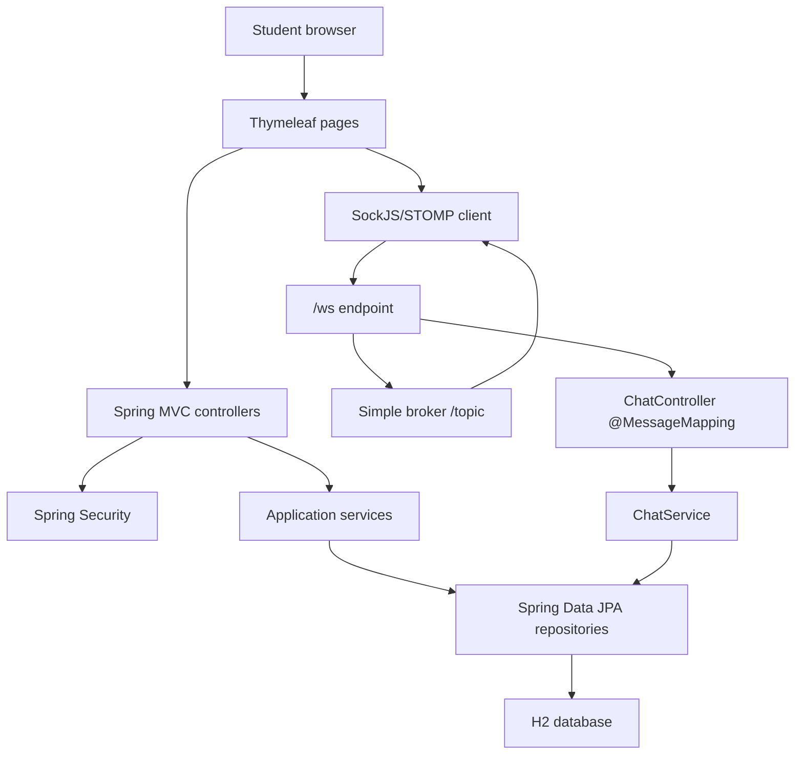
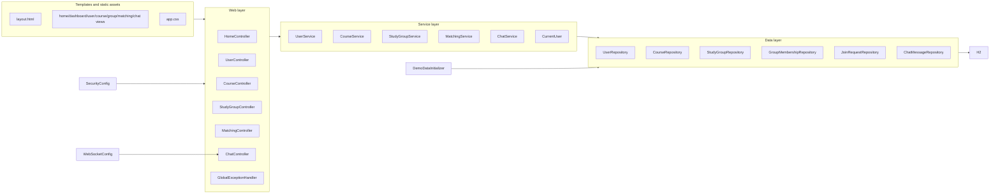
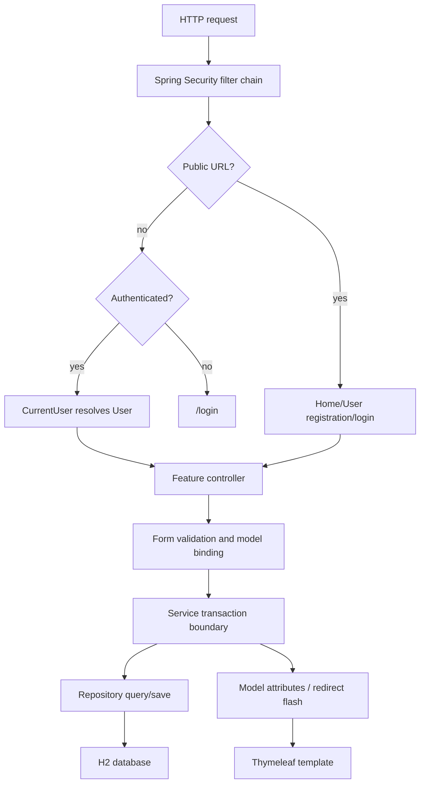
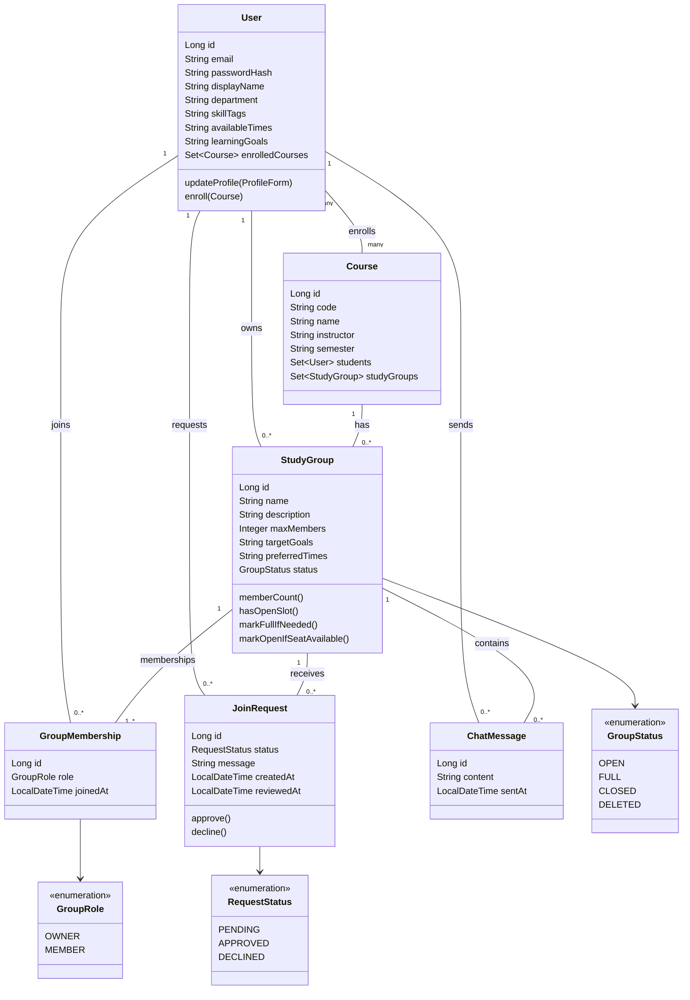
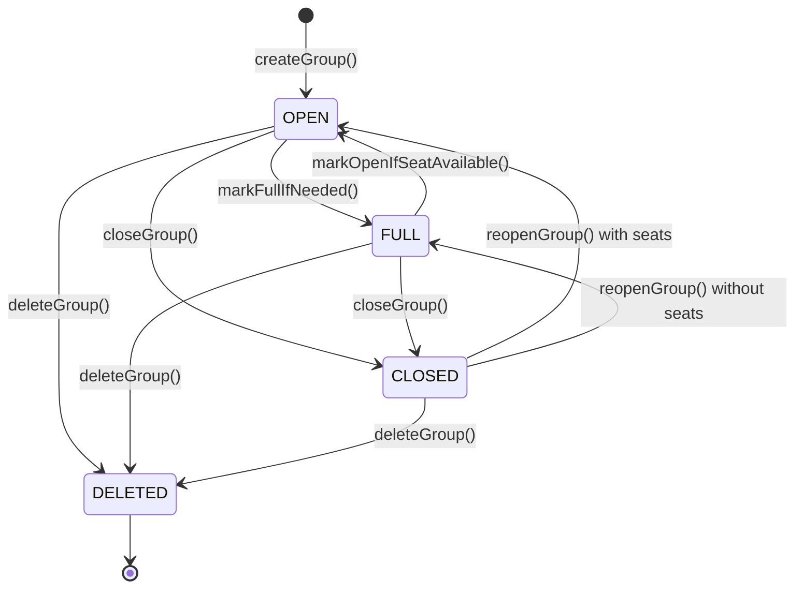
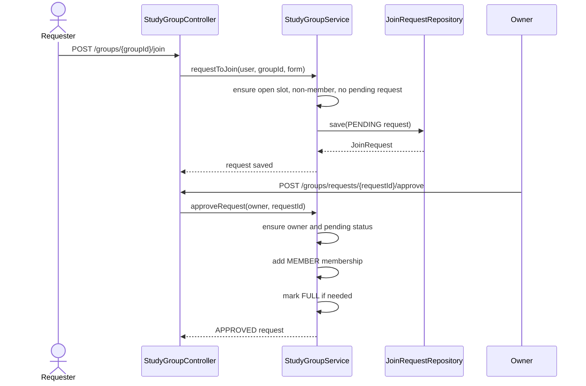
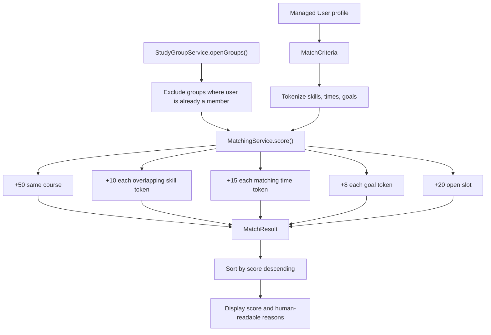
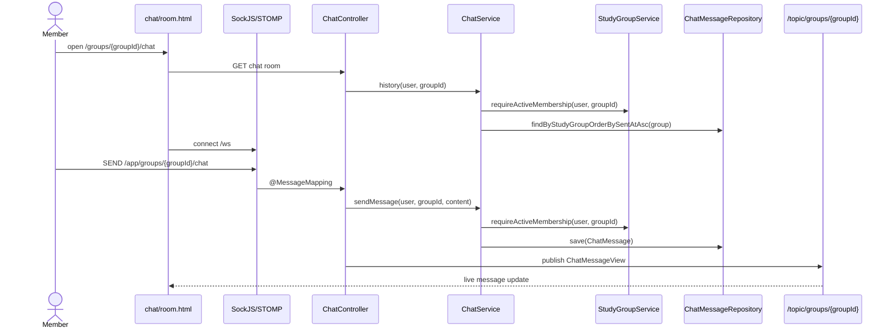

# Architecture

This diagram set describes the `master` branch implementation: a Spring Boot
MVC application with Thymeleaf pages, Spring Security authentication, JPA/H2
persistence, rule-based recommendations, and WebSocket/STOMP group chat.

## System Context

## Package Flow

## HTTP Request Flow

## Domain Model

## Study Group Lifecycle

## Join Request Flow

## Matching Score

## Chat Flow

