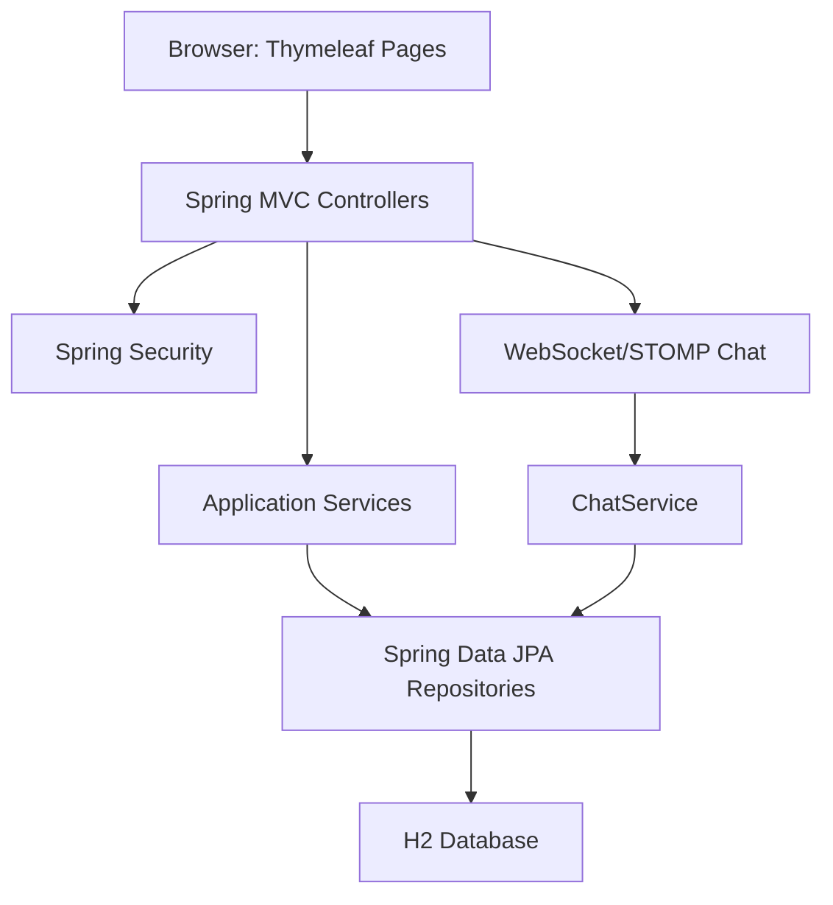
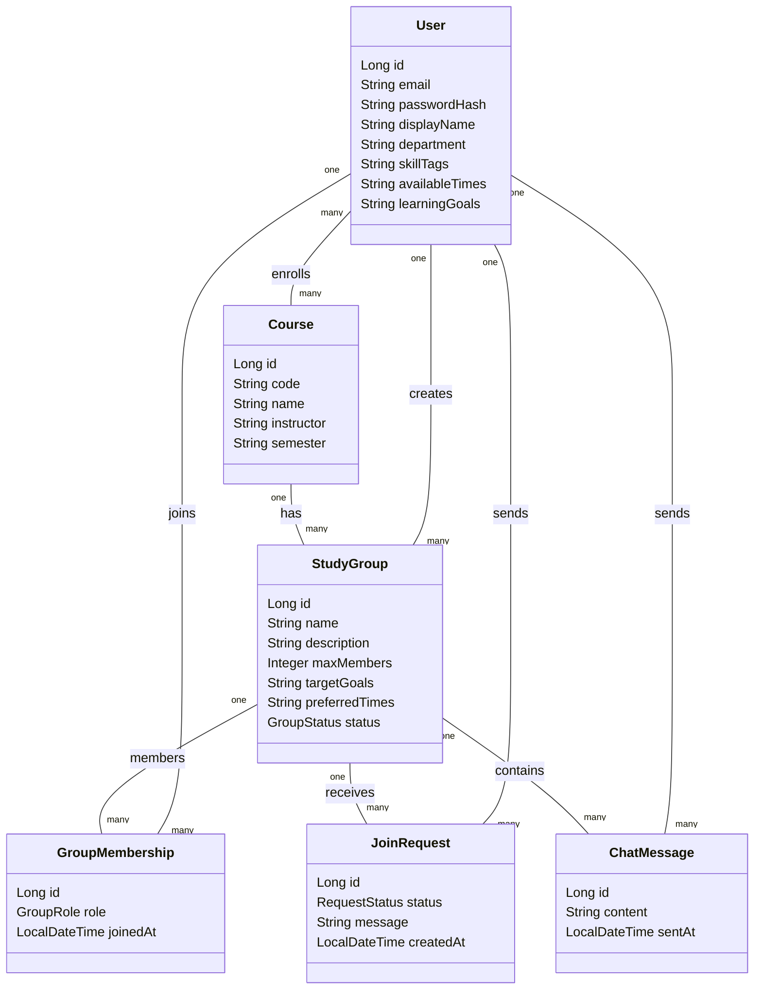
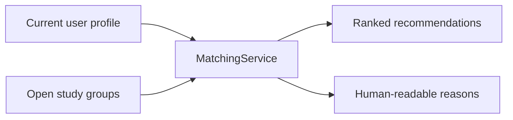

# Architecture

## Request Flow

```mermaid
flowchart TD
    Browser["Browser: Thymeleaf Pages"] --> Controller["Spring MVC Controllers"]
    Controller --> Service["Application Services"]
    Service --> Repository["Spring Data JPA Repositories"]
    Repository --> DB["H2 Database"]
    Controller --> Security["Spring Security"]
    Controller --> Chat["WebSocket/STOMP Chat"]
    Chat --> ChatService["ChatService"]
    ChatService --> Repository
```

## Domain Model

```mermaid
classDiagram
    class User {
        Long id
        String email
        String passwordHash
        String displayName
        String department
        String skillTags
        String availableTimes
        String learningGoals
    }

    class Course {
        Long id
        String code
        String name
        String instructor
        String semester
    }

    class StudyGroup {
        Long id
        String name
        String description
        Integer maxMembers
        String targetGoals
        String preferredTimes
        GroupStatus status
    }

    class GroupMembership {
        Long id
        GroupRole role
        LocalDateTime joinedAt
    }

    class JoinRequest {
        Long id
        RequestStatus status
        String message
        LocalDateTime createdAt
    }

    class ChatMessage {
        Long id
        String content
        LocalDateTime sentAt
    }

    User "many" -- "many" Course : enrolls
    Course "one" -- "many" StudyGroup : has
    User "one" -- "many" StudyGroup : creates
    StudyGroup "one" -- "many" GroupMembership : members
    User "one" -- "many" GroupMembership : joins
    StudyGroup "one" -- "many" JoinRequest : receives
    User "one" -- "many" JoinRequest : sends
    StudyGroup "one" -- "many" ChatMessage : contains
    User "one" -- "many" ChatMessage : sends
```

## Matching Score

```mermaid
flowchart LR
    Criteria["Current user profile"] --> Score["MatchingService"]
    Groups["Open study groups"] --> Score
    Score --> Ranked["Ranked recommendations"]
    Score --> Reasons["Human-readable reasons"]
```
